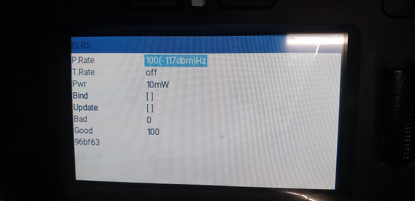
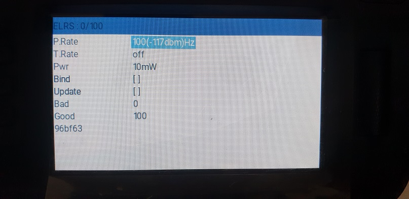

## Flashing the Latest OpenTX or EdgeTX for CRSFShot/Mixer Sync

ExpressLRS requires CRSFShot or Mixer Sync to ensure full support for high packet rates. Starting with [OpenTX-2.3.12](https://www.open-tx.org/2021/06/14/opentx-2.3.12), `CRSFshot` has been fully implemented, and thus you will have to update your OpenTX radio to these newer versions.

Another alternative is [EdgeTX](https://github.com/EdgeTX/edgetx/releases), the bleeding edge fork of OpenTX.

These firmwares allow flashing of `.elrs` files too.

## CRSF Protocol

ExpressLRS uses the CRSF serial protocol to communicate between the transmitter and the TX module. To set this up, enter into your model settings, and on the "Model Setup" tab, enable your "External RF" and select "CRSF" as the protocol:

**NOTE: Make sure the internal module is turned off.**

**NOTE: Make sure the internal module is turned off.**

## Serial Baud Rate

On some transmitters, the baud rate for comms between the opentx and the ExpressLRS module can be changed. The two rates available are 115200 and 400000. ExpressLRS supports both rates (auto switches to the correct rate on power-up), however, we have found that on the R9M 2018 modules, the inverter IC's that are used are not capable of reliably handling 400k baud. If you're using an R9M 2018 module, select 115200 baud in OpenTX, or do the resistor mod described on the [R9M 2018 Resistor Mod](https://github.com/ExpressLRS/ExpressLRS/wiki/Inverter-Mod-for-R9M-2018) page.

The QX7, X10/S, X12 will also going to require the [Crossfire Mod](https://blog.seidel-philipp.de/fixed-inverter-mod-for-tbs-crossfire-and-frsky-qx7/) if you're going to use 400k baud rates for use with higher packet rates, particularly with the 2.4G ExpressLRS Modules. Alternatively, EdgeTX can be flashed into these Radios and have OneBit enabled. See below for info regarding the X9D(plus).

The X9D(plus) can't change its Max Bauds settings, but it has been found to be finicky, causing unstable packet transfers, and constant Telemetry Lost/Recovered messages from OpenTX. One fix for this is the use of the OneBit firmware or EdgeTX. Click [here](/hardware/x9d-troubleshooting) for more info.

## ADC Filter

The ADC filter is enabled by default in OpenTX and is known to cause issues with RC Command data. This can result in "jagged" RC command responses in black box logs, caused by sequential RC packets that have the same command value (which were "smoothed" by the ADC filter). We recommend turning the ADC filter OFF in [OpenTX](https://www.youtube.com/watch?v=ESr2H_EZ89Q).

## Lua Script

For faster access to the Lua script, use the Crossfire Configuration Tools in `Menu -> Tools`. For Higher bad:good packets refresh rate and also less RC command interuption, save the `ELRS.lua` File from this link: [ExLRS Lua Script](https://github.com/ExpressLRS/ExpressLRS/tree/master/src/lua) onto the radio's SD Card in the `Scripts/Tools` folder and Long Press the "SYS" button (for T16 or similar Radios) or the "Menu" button (for Taranis X9D or similar Radios) to access the Tools Menu where you can find ELRS script ready to run with only one click.

if your handset has the black and white display and your handset is NOT X9D or X9D+, use the telemetry script in the black_and_white_display_128x64 folder.

if your handset is the X9D or X9D+, use the telemetry script in the x9d_212x64 folder.

if your handset has the colored screen display, use the telemetry script in the color_display_480x272 folder.

Another way to get the ELRS Lua Script is via the ExpressLRS Configurator.

Here's how it looks in the Tools Menu:

**Note: The following section will not yet work for you if your TX module is not yet flashed with ExpressLRS**

The Lua script has an important feature that's highly valuable with troubleshooting. It tells you how many bad UART packets and how many good UART packets per second it's getting from the radio. It can be used to confirm the communication between the Radio and the TX module is working properly. 

e.g. if you have set the Packet Rate to 200Hz, 0/200 means 0 bad packets and 200 good packets (per second).

with crossfire Tools you can see them as the Bad and Good parameters as in the picture above.

with the ELRS.lua you will see them also at the top of the page where the value will be updated in a consistent and faster rate. (picture above)

bonus tips : ELRS.lua also works as TELEMETRY Script.

The value should match the selected packet rate (200 for 200Hz, 500 for 500Hz, etc..)

If it doesn't and is stuck at 250 that means `CRSFshot` isn't working. Go back to the top of this page and verify you've done all the steps above correctly.

### Troubleshooting Lua Script

when no parameter is shown for a long time in the Lua Script, that would means the Protocol set for the External Module is incorrect or that the module is not properly connected to the pins of the jr bay of the radio. The latter could mean that the module's PCB has gotten loose, common with the first batches of the ES24TX modules from Happymodel.

If the value of bad:good packet from the lua script is showing 0/142, etc., have a look at your model settings and make sure the internal RF module is set to off.

The "96bf63" from the photo above is the Commit Hash of the firmware version that the module has. You can reference this hash from [Releases](https://github.com/ExpressLRS/ExpressLRS/releases).

**Now that your radio is set, you can now proceed with flashing ExpressLRS!**